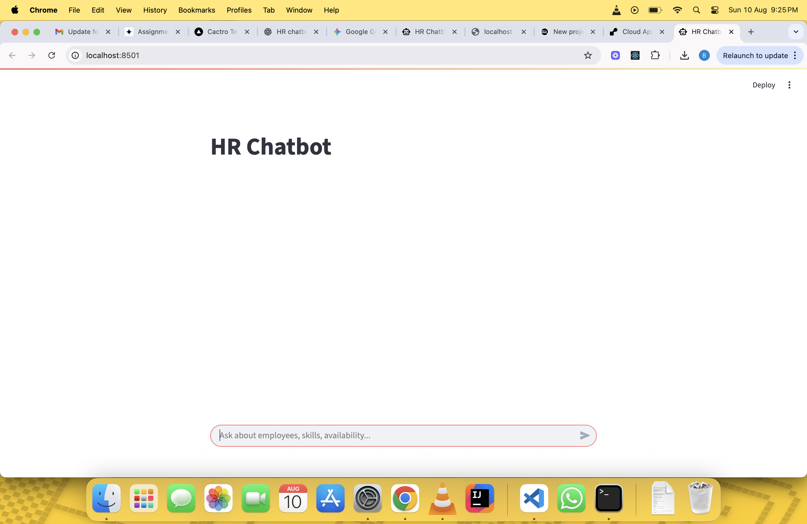
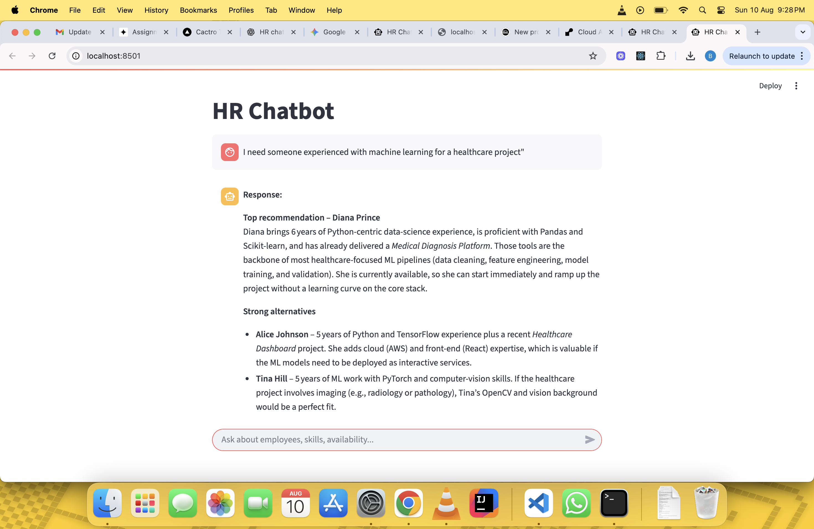

# HR Resource Query Chatbot

## Overview

The HR Resource Query Chatbot is an AI-powered assistant that helps HR teams query employee profiles for project allocation, staffing, and resource planning. It leverages Retrieval-Augmented Generation (RAG) to combine semantic search with OpenAI's language model for accurate, context-aware responses.

## Features

- Natural language interface to ask HR-related queries
- RAG-based architecture with FAISS and sentence-transformers
- Employee profile search with filters (skills, experience, availability)
- Streamlit-based frontend interface
- FastAPI-powered backend
- Sample dataset with realistic employee profiles

## Architecture

**Component Breakdown:**

- **Frontend**: Built with Streamlit for a lightweight interactive UI
- **Backend**: FastAPI REST server with multiple endpoints
- **Search Engine**: FAISS for fast vector similarity search
- **Embeddings**: SentenceTransformer model for semantic understanding
- **LLM**: OpenAI GPT models (via API)
- **Data**: Sample static employee dataset in-memory

**RAG Flow:**

1. User submits query
2. Query is embedded and matched against vector store
3. Top-k employee profiles are retrieved as context
4. Prompt is constructed using user query + context
5. Prompt sent to OpenAI to generate final response

## Setup & Installation

```bash
# Clone the repo
https://github.com/your-username/hr-chatbot
cd hr-chatbot

# Create virtual environment
python -m venv venv
source venv/bin/activate  # or venv\Scripts\activate on Windows

# Install dependencies
pip install -r requirements.txt

# Start backend server
uvicorn app:app --reload

# In another terminal, run frontend
streamlit run app.py
```

## API Documentation

### POST /chat

- **Description**: Chat endpoint using full RAG to answer queries
- **Request Body**:

```json
{
  "query": "Who is available next week with React experience?"
}
```

- **Response**:

```json
{
  "response": "Top recommendation – Alice Johnson
Alice has 5 years of experience with React (alongside Python, AWS, and TensorFlow) and has delivered large‑scale projects such as an e‑commerce platform and a healthcare dashboard. Her deep React expertise and proven track record on complex, data‑driven applications make her a strong fit for any front‑end work you need next week, and she’s listed as currently available."
}
```

### GET /employees/search

- **Query Params**: `skills`, `experience`, `availability`
- **Example**: `/employees/search?skills=Python&experience=3`
- **Returns**: Filtered employee list

## AI Development Process

- **Tools Used**: ChatGPT 4o, Gemini(for data generation)
- **Use Cases**:
  - ChatGPT: For architecture decisions, writing prompt engineering logic, building semantic search
  - Copilot: For completing boilerplate code and refactoring
- **AI-Assisted Code**: \~70%
- **Human-Written**: \~30% (prompt design, tuning, custom search logic)
- **Notable AI Help**:
  - Rewriting prompts for better coherence
  - Debugging Streamlit state and FastAPI async issues
- **Challenges**:
  - Getting coherent responses with weak prompt-context link
  - Deciding vector search thresholds manually

## Technical Decisions

- **OpenAI vs OSS**: Chose OpenAI for reliability and high-quality output within tight deadline
- **No Ollama**: For simplicity and speed of integration
- **Trade-offs**:
  - Cloud API costs vs local inference
  - Simpler dev experience vs full control

## Future Improvements

- Add support for conversation memory (chat continuation)
- Connect to real employee database or API
- Add authentication and role-based access
- Improve prompt adaptability for general HR workflows

## Demo

- **Local Run**: Follow setup instructions above
- **Screenshots**: 
  
- **Demo Video**: https://www.loom.com/share/c004c7bbb81548cfbbdb63797d7be66a?sid=7186cf70-4821-4b39-89c0-1c23b57a2efc
